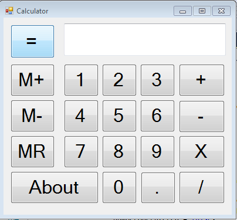

Calculator
==========
Created by Jay Tayade

A Fully featured calculator made in C#

  

This is a real screenshot of what I have done so far. 

Contributing
============

Anyone is free to fork the repository and edit in any capacity they desire. 
I reccomend visiting the DevPlan file to get a sense of the project scope

Pull requests will be handled on a case by case basis.

Using the Development Plan
==========================

Use the development plan to keep track of all changes. It is the first file I will look to when evaluating forks

 

